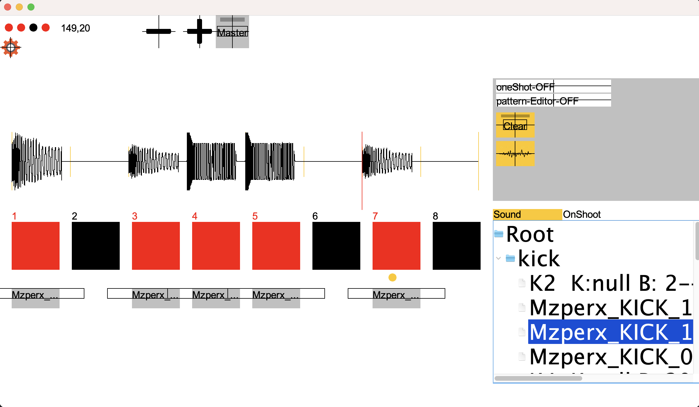
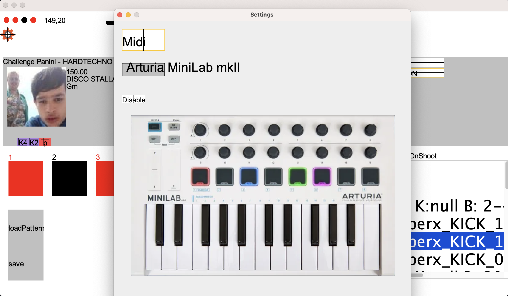

# Cdj-BeatBox
Link your computer to the local pioneer-Cdj-network and start the program. This programm allows you to interact with Cdjs and play your own virtual drum-machine synced to the network-cdjs.
 
Also features MIDI-control for MiniLab MK II and in the future other MIDI-device with custom midi mapping.

 
More will come soon.....

---

### Preview:
Drum machine with debug mode on:  

Settings-window with debug mode on:  

Custom Audio render engine:  
